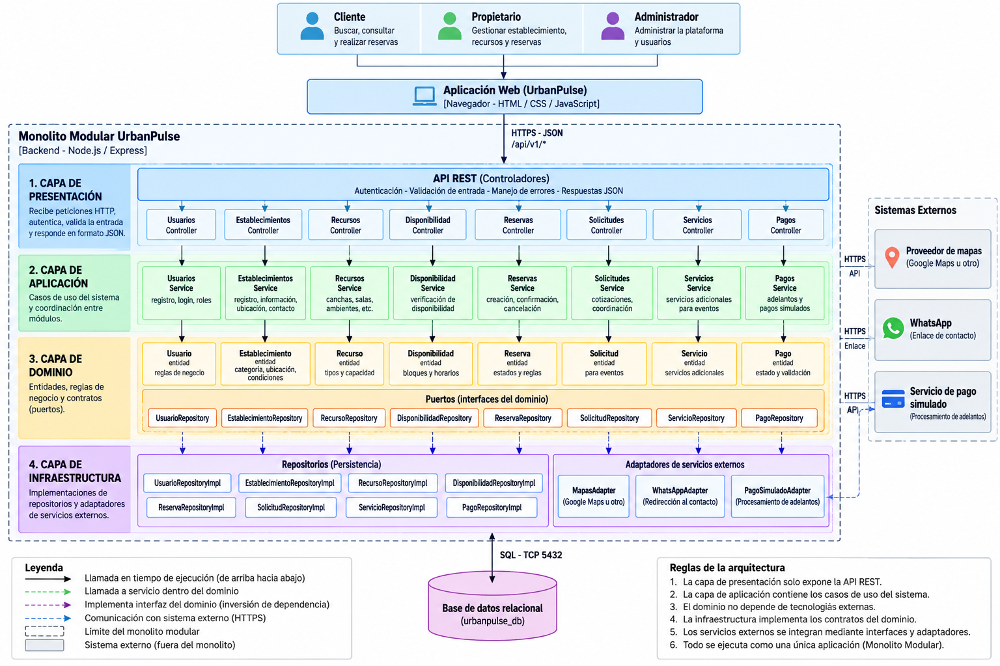

# Enfoque arquitectónico

El enfoque arquitectónico seleccionado para UrbanPulse es **Clean
Architecture (Arquitectura Limpia)**.

Este enfoque se aplicará dentro del estilo de **Monolito Modular**
definido para el sistema, permitiendo separar las reglas del negocio
de los detalles tecnológicos y de las integraciones externas.

---

## 1. Descripción del enfoque

| Elemento | Descripción aplicada a UrbanPulse |
|---|---|
| **Patrón / enfoque arquitectónico** | **Clean Architecture (Arquitectura Limpia)**. |
| **Objetivo** | Separar las reglas del negocio de los detalles tecnológicos y controlar las dependencias hacia el dominio. |
| **¿Qué problema resuelve?** | Evita el acoplamiento entre la interfaz web, las reglas de reserva, la persistencia y los servicios externos como mapas, WhatsApp y pago simulado. |
| **Capas definidas** | Presentación, Aplicación, Dominio e Infraestructura. |
| **Beneficios** | • Facilita el mantenimiento y las pruebas.<br>• Permite cambiar tecnologías externas sin modificar las reglas principales del negocio.<br>• Facilita la incorporación de nuevas modalidades de reserva.<br>• Mejora la separación de responsabilidades. |

---

# 2. Capas de Clean Architecture

La arquitectura de UrbanPulse se organizará en cuatro capas principales.

```text
┌──────────────────────────────────────────────────────┐
│                  PRESENTACIÓN                        │
│                                                      │
│              Aplicación Web / API REST               │
└──────────────────────────┬───────────────────────────┘
                           │
                           ▼
┌──────────────────────────────────────────────────────┐
│                   APLICACIÓN                          │
│                                                      │
│              Casos de uso del sistema                │
└──────────────────────────┬───────────────────────────┘
                           │
                           ▼
┌──────────────────────────────────────────────────────┐
│                     DOMINIO                           │
│                                                      │
│       Entidades - Reglas - Puertos - Contratos       │
└──────────────────────────┬───────────────────────────┘
                           │
                           ▼
┌──────────────────────────────────────────────────────┐
│                 INFRAESTRUCTURA                       │
│                                                      │
│     Persistencia - Adaptadores - Servicios externos  │
└──────────────────────────────────────────────────────┘
```
---
# 3. Diagrama del enfoque arquitectónico


